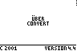

# Über Convert

> I do not carry such information in my mind since it is readily available in ~books~ **a TI-83**. ...The value of a college education is not the learning of many facts but the training of the mind to think. -Albert Einstein

## Applications

###Temperature
To/From:
* Celcius
* Fahrenheit
* Kelvins

###Measurements
To/From:
* Metric
* Standard/English

###Energy
To/From:
* (kilo)calories
* (kilo)joules

###Mass/Volume/Density
Solve for:
* Mass
* Volume
* Density

###Light Energy
Solve for:
* Frequency
* Wavelength (nm)
* Wavelength (m)
* Light (j*s)

###Calories
Solve for:
* Mass
* Delta temp
* Calories

###Pressure
Solve for:
* Pressure
* Force
* Area

## Credits
I don't honestly remember entirely all the contributors to this application.  There were three or four of us in high school who who were supremely lazy when it came to Chemistry and supremely passionate when it came to programming.  Thanks, guys.

## Disclaimer
Yes, using this is probably technically "cheating," at least it was when we wrote it.
